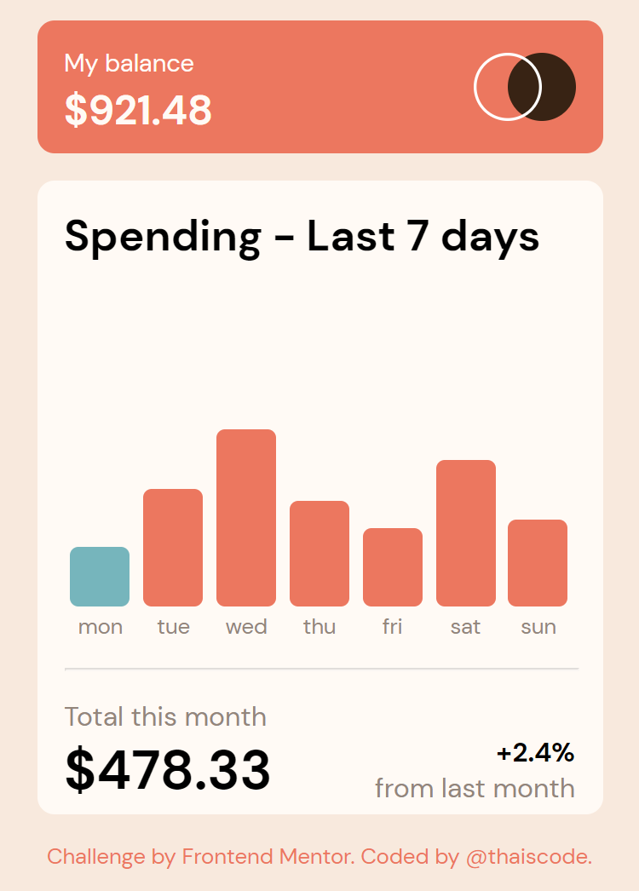
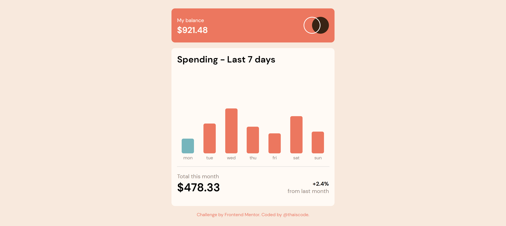
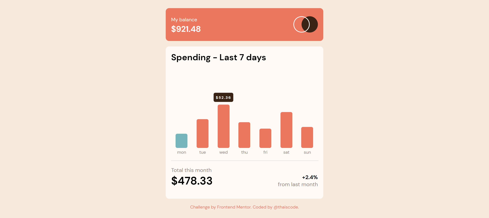

# Frontend Mentor - Expenses chart component solution

This is a solution to the [Expenses chart component challenge on Frontend Mentor](https://www.frontendmentor.io/challenges/expenses-chart-component-e7yJBUdjwt). Frontend Mentor challenges help you improve your coding skills by building realistic projects. 

## Table of contents

- [Overview](#overview)
  - [The challenge](#the-challenge)
  - [Screenshot](#screenshot)
  - [Links](#links)
- [My process](#my-process)
  - [Built with](#built-with)
  - [What I learned](#what-i-learned)
  - [Continued development](#continued-development)
  - [Useful resources](#useful-resources)
- [Author](#author)

## Overview

### The challenge

Users should be able to:

- View the bar chart and hover over the individual bars to see the correct amounts for each day
- See the current day’s bar highlighted in a different colour to the other bars
- View the optimal layout for the content depending on their device’s screen size
- See hover states for all interactive elements on the page
- **Bonus**: Use the JSON data file provided to dynamically size the bars on the chart

### Screenshot

### Links

- Solution URL: [Solution](https://www.frontendmentor.io/solutions/expenses-chart-component-5LHE6CLTmy)
- Live Site URL: [Live site](https://thaiscode.github.io/expenses-chart-component-main/)

## My process

### Built with

- Semantic HTML5 markup
- CSS custom properties
- Flexbox
- Mobile-first workflow
- Javascript vanilla
- BEM

### What I learned

In this challenge I mainly learned how to consume and use a json file. In addition to new event listeners and some javascript methods.

### Continued development

I will continue with my studies focused on pure javascript.

### Useful resources

- [MDN](https://developer.mozilla.org) - All my doubts were cleared by MDN.

## Author

- Website - [thaiscode](https://github.com/thaiscode)
- Frontend Mentor - [@thaiscode](https://www.frontendmentor.io/profile/thaiscode)